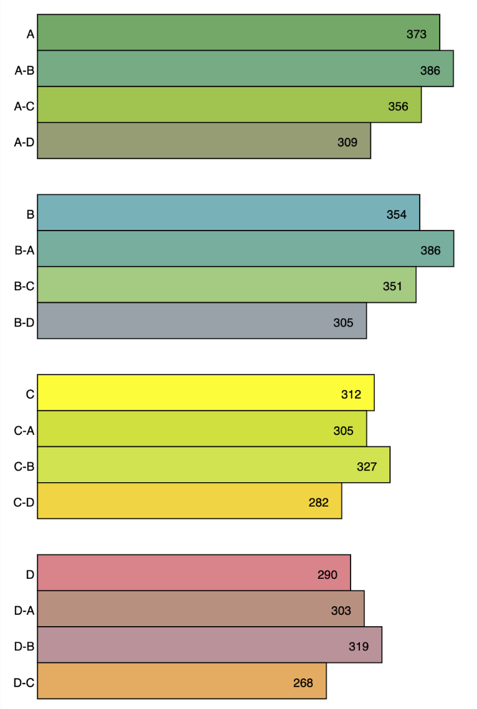
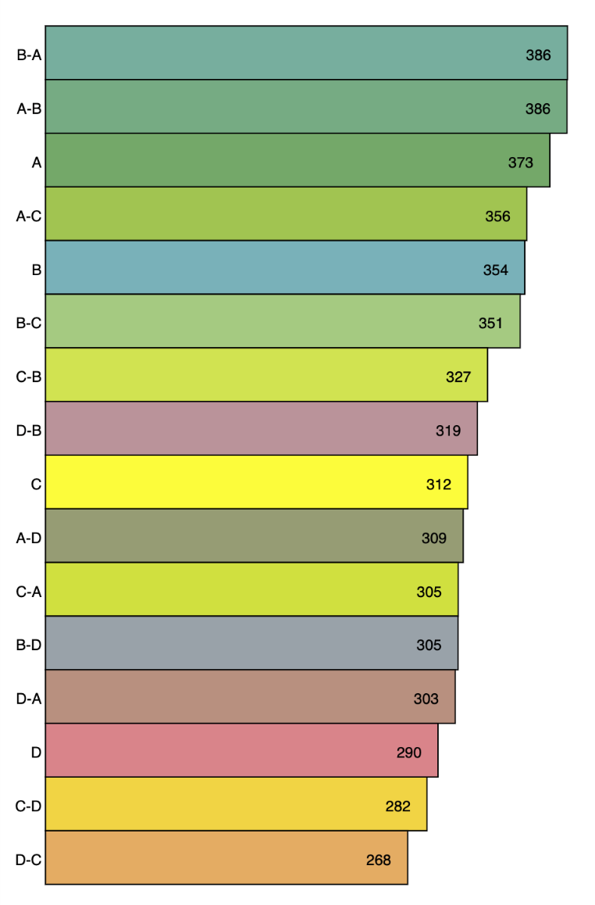

Drawing
-------

Up to this point, all we've done is _massage_ the data we have to get it into a format we'd like visusalize. There's a lot we could do here (for instance, we can actually download `geoJSON` data that describes a polygon that represents the census tract and then draw that on the screen, perhaps with some colorization), but all we're going to do for the moment is a bar chart. 

## The Bar Chart Drawing Function

We'd like to be able to make both of these drawings (one which includes four seperate bar graphs) with the same function:

|**Housing Price Index for HOLC Grades**|
|:-:|
||
|Grouped by Primary Class|

|**Housing Price Index for HOLC Grades**|
|:-:|
||
|Sorted by Mean HPI|

The signature for the bar chart function is as follows: 

```javascript
function drawHBarChart(x,y,w,h,data,decorations,bounds={min:0,max:450})
```

|parameter|description|
|:-|:-:|
|`x`|the x location of the bar chart|
|`y`|the y location of the bar chart|
|`w`|the width of the bar chart|
|`h`|the height of the bar chart|
|`data`|an array of numerical data|
|`decorations`|an array of objects with colors and labels that correspond to the data (same order)|
|`bounds`|an object with a min and max value that the bars' sizes should be based upon|

The height of the bars should be based on the amount of data and the height of the bar chart. 

The basic algorithm is something along the lines of: 

* loop over the data
* calculate the width of the bar based off the value and the bounds
* draw the rectangle with the appropriate color and and lables

## Getting the Data

The really tricky part here is getting the data into an appropriate form. The function requires an array of numeric values, and the graphs show, essentially, aggregate data (the average of all the HPI values for a particular HOLC-grade-based classification).

The algorithm here would be: 

* loop over every tract
* add the hpi value to the total for the appropriate classification
* update the count for the appropriate classification
* after all values are added, calculate the average
* convert the result to an array

## The Decorations

The decorations is an array of objects corrosponding to the value array above. The objects have a label and a color. 

The label is the classification (e.g., A, C-D)

The colors in the examples were generated by using the `lerpColor` function to calculate the colors in between the two classes. 

# Challenge

1. Write a barchart function.
   * **CS1** You can use random colors for your bars
   * **H/AP** You need to pass in colors via the decorations parameter and to draw the bars with those colors.
2. Write a code prior to calling the barchart function that generates the data array for the barchart function
3. **H/AP** Add labels via the decorations parameter